# 3D-Scanned-Object-Library
A collection of 3D scanned objects released under GPL 3.0 license. If you use these files to create something it has to be released under the same license. 

Some scans better than other... some will be updated in the future... maybe. 

## Bosch
| Thumbnail | Description | Version | Date | Scanner |
| :-------: | :---------- | :-----: | :---: | :-----| 
| 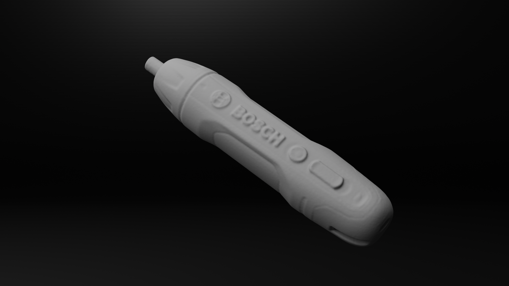 | <a href="Bosch/Bosch_Go_v2.stl" title="Bosch_Go_v2.stl">Bosch Go 2</a> | v2 | 2024-07-03 | 3DMaker Pro Moose |
| 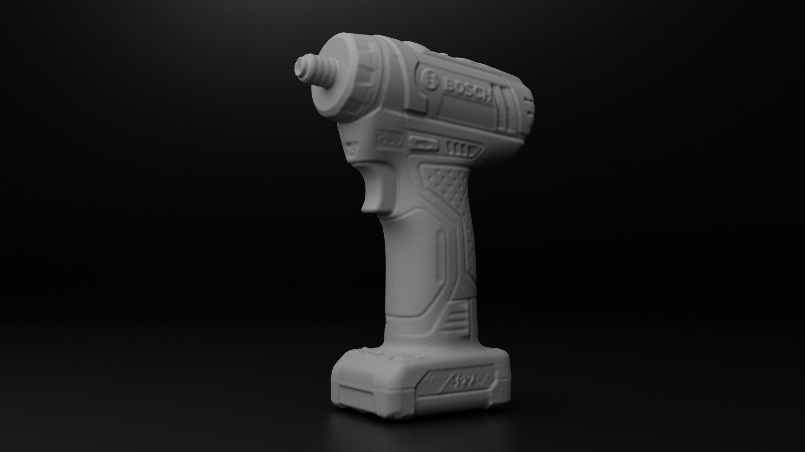 | <a href="Bosch/Bosch_GSR_HX_10.8V_v1.stl" title="Bosch_GSR_HX_10-8V_v1.stl">Bosch GSR 10.8V HX</a> | v1 | 2024-06-26 | 3DMaker Pro Moose |
|  | <a href="Bosch/Bosch_GSR_HX_10.8V_v2.stl" title="Bosch_GSR_HX_10-8V_v2.stl">Bosch GSR 10.8V HX</a> | v2 | 2024-06-26 | Creality Raptor |
| 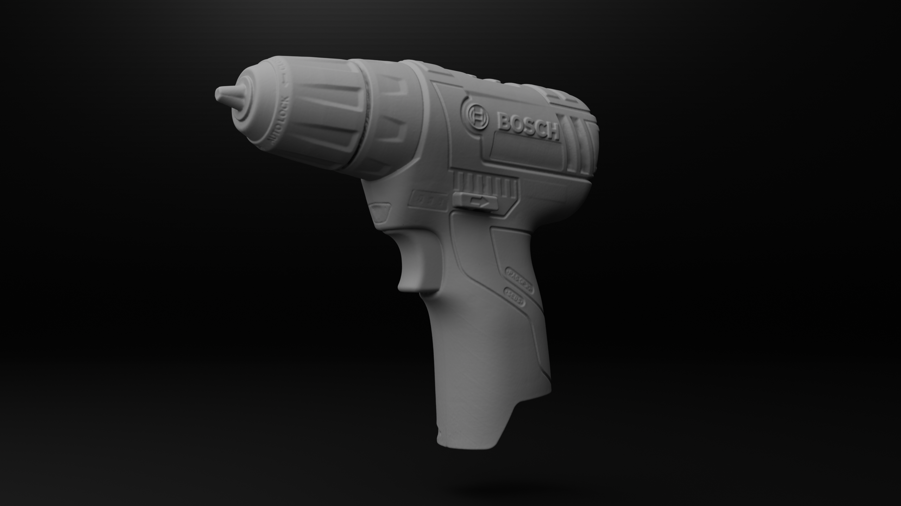 | <a href="Bosch/Bosch_GSR_10.8V-EC_v1.stl" title="Bosch_GSR_10.8V-EC_v1.stl">Bosch GSR 10.8V-EC</a> | v1 | 2025-01-11 | Creality Raptor |
| 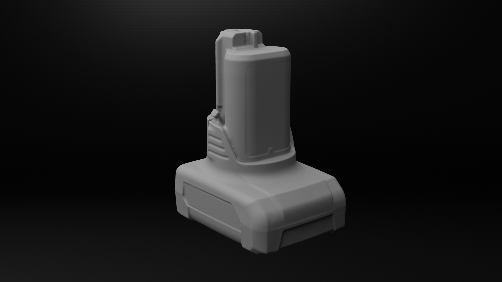 | <a href="Bosch/Bosch_12V_4.0Ah_Battery v1.stl" title="Bosch_12V_4.0Ah_Battery v1.stl">Bosch 12V 4.0Ah Battery</a> | v1 | 2025-01-11 | Creality Raptor |
| 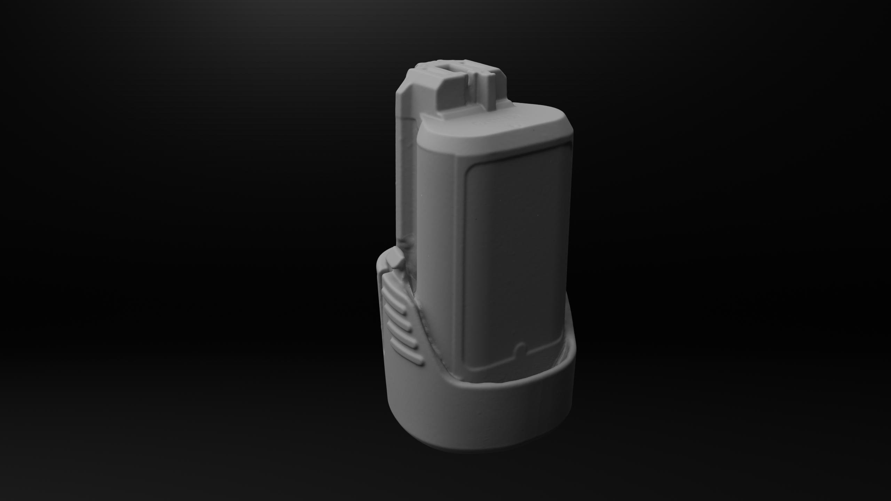 | <a href="Bosch/Bosch_12V_2.0Ah_Battery v1.stl" title="Bosch_12V_2.0Ah_Battery v1.stl">Bosch 12V 2.0Ah Battery</a> | v1 | 2025-01-12 | Creality Raptor |

## Engineer
| Thumbnail | Description | Version | Date | Scanner |
| :-------: | :---------- | :-----: | :---: | :-----| 
| 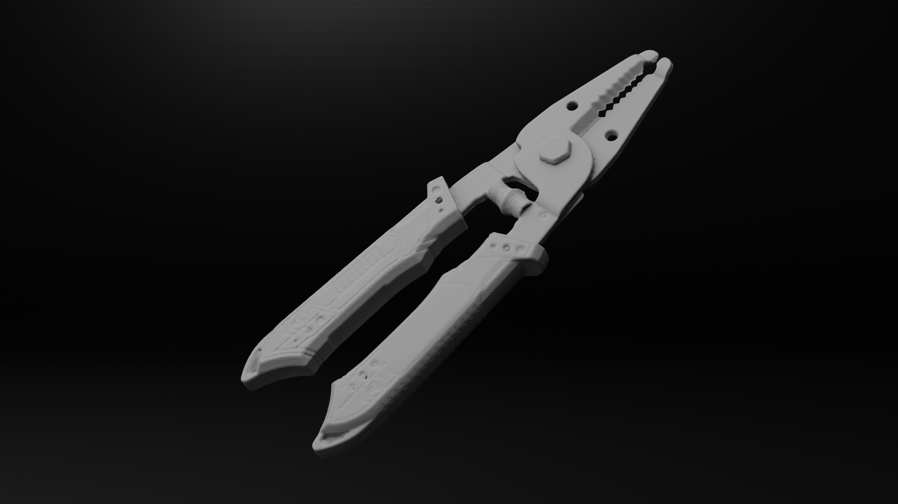 | <a href="Engineer/Engineer_PA-06_v1.stl" title="Engineer/Engineer_PA-06_v1.stl">Engineer PA-06</a> | v1 | 2025-01-09 | 3DMaker Pro Moose |
| 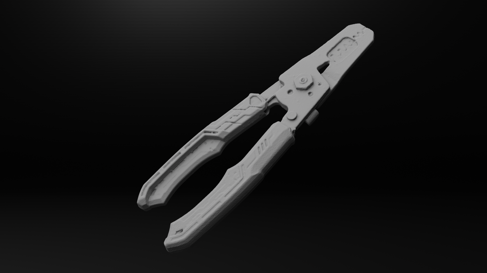 | <a href="Engineer/Engineer_PA-24_v1.stl" title="Engineer/Engineer_PA-24_v1.stl">Engineer PA-24</a> | v1 | 2025-01-09 | 3DMaker Pro Moose |

## Knipex
| Thumbnail | Description | Version | Date | Scanner |
| :-------: | :---------- | :-----: | :---: | :-----| 
| 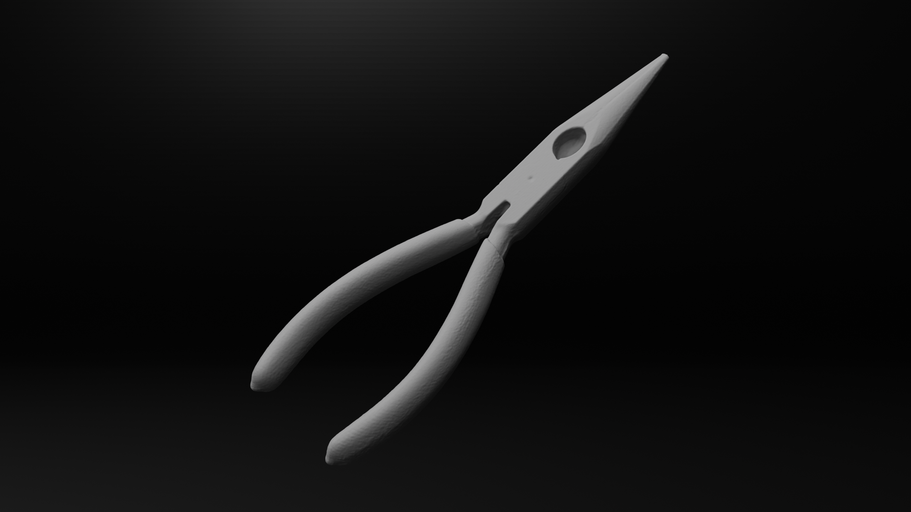 | <a href="Knipex/Knipex_25_01_160_v1.stl" title="Knipex/Knipex_25_01_160_v1.stl">Knipex 25 01 160</a> | v1 | 2025-01-09 | 3DMaker Pro Moose |
| 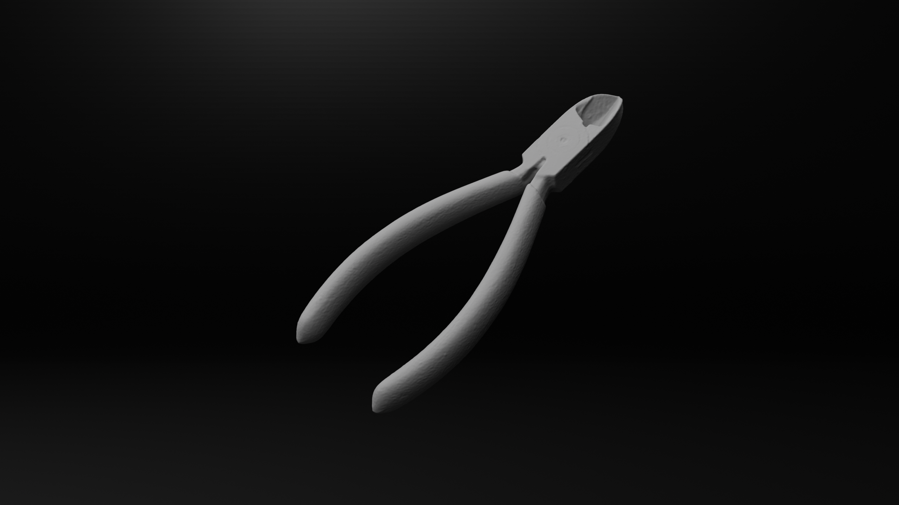 | <a href="Knipex/Knipex_70_01_125_v1.stl" title="Knipex/Knipex_70_01_125_v1.stl">Knipex 70 01 125</a> | v1 | 2025-01-09 | 3DMaker Pro Moose |
| 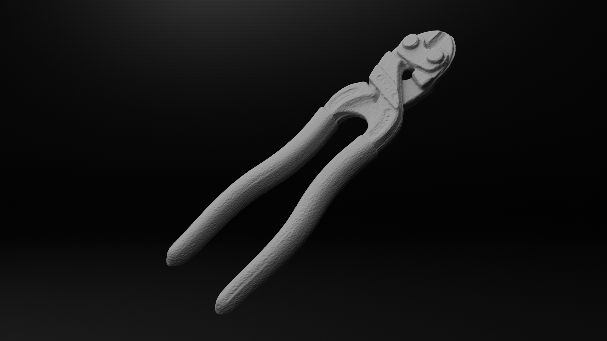 | <a href="Knipex/Knipex_71_01_160_v1.stl" title="Knipex/Knipex_71_01_160_v1.stl">Knipex 71 01 160</a> | v1 | 2025-01-09 | 3DMaker Pro Moose |
| 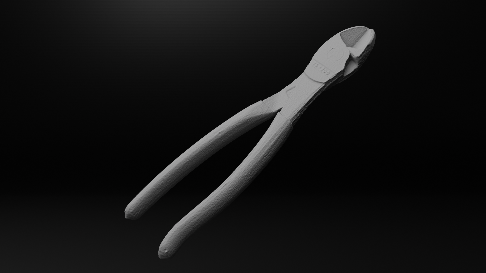 | <a href="Knipex/Knipex_74_01_200_v1.stl" title="Knipex/Knipex_74_01_200_v1.stl">Knipex 74 01 200</a> | v1 | 2025-01-09 | 3DMaker Pro Moose |
| 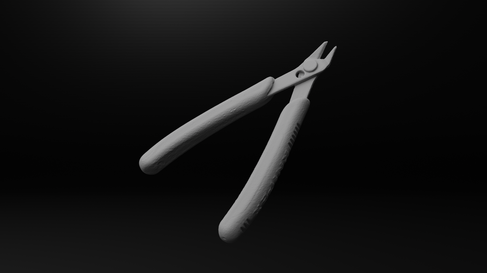 | <a href="Knipex/Knipex_78_61_125_v1.stl" title="Knipex/Knipex_78_61_125_v1.stl">Knipex 78 61 125</a> | v1 | 2025-01-09 | 3DMaker Pro Moose |
| 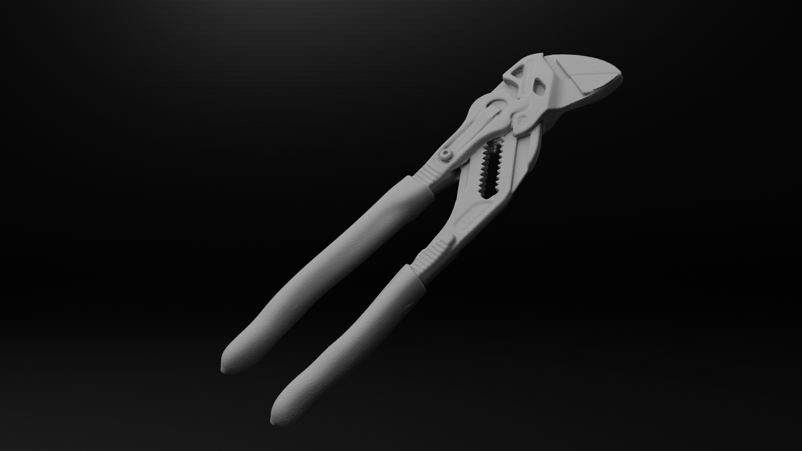 | <a href="Knipex/Knipex_86_03_180_v1.stl" title="Knipex/Knipex_86_03_180_v1.stl">Knipex 86 03 180</a> | v1 | 2025-01-09 | 3DMaker Pro Moose |
| 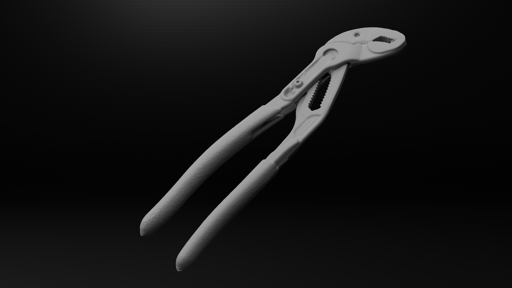 | <a href="Knipex/Knipex_87_01_180_v1.stl" title="Knipex/Knipex_87_01_180_v1.stl">Knipex 87 01 180</a> | v1 | 2025-01-09 | 3DMaker Pro Moose |

## Wera
| Thumbnail | Description | Version | Date | Scanner |
| :-------: | :---------- | :-----: | :---: | :-----| 
| 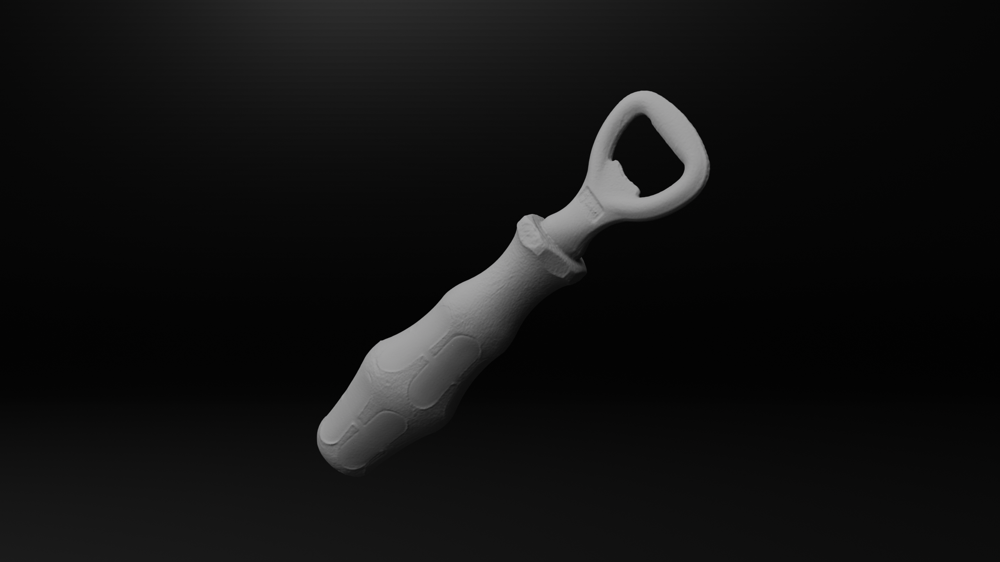 | <a href="Wera/Wera_bottle_opener_v1.stl" title="Wera/Wera_bottle_opener_v1.stl">Wera Bottle Opener</a> | v1 | 2025-01-09 | 3DMaker Pro Moose |
| 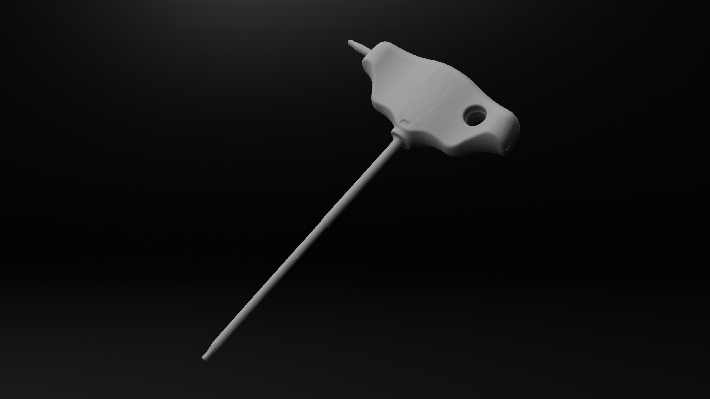 | <a href="Wera/Wera_454_2x100_v1.stl" title="Wera/Wera_454_2x100_v1.stl">Wera 454 2.0x100</a> | v1 | 2025-01-11 | Creality Raptor |
|  | <a href="Wera/Wera_454_2-5x100_v1.stl" title="Wera/Wera_454_2-5x100_v1.stl">Wera 454 2.5x100</a> | v1 | 2025-01-11 | Creality Raptor |
| 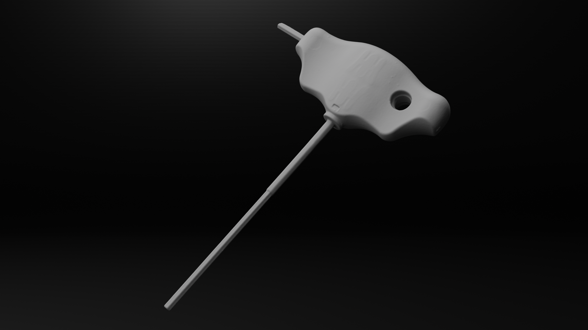 | <a href="Wera/Wera_454_3x100_v1.stl" title="Wera/Wera_454_3x100_v1.stl">Wera 454 3.0x100</a> | v1 | 2025-01-11 | Creality Raptor |
|  | <a href="Wera/Wera_454_4x100_v1.stl" title="Wera/Wera_454_4x100_v1.stl">Wera 454 4.0x100</a> | v1 | 2025-01-11 | Creality Raptor |
| 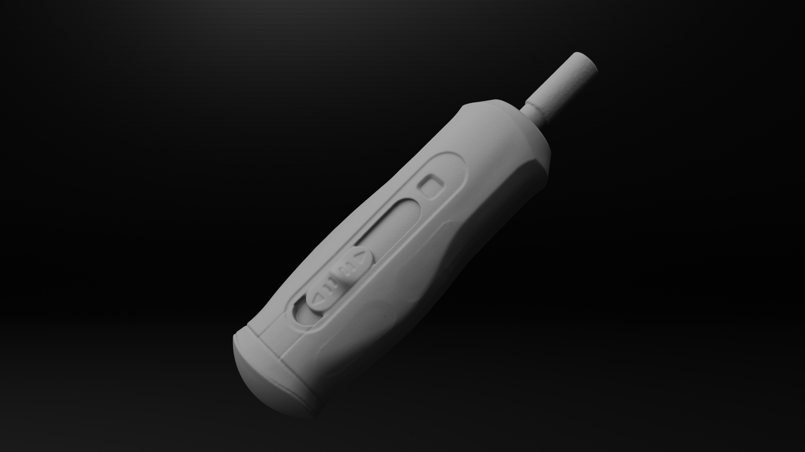 | <a href="Wera/Wera_7510_Torque_driver_v1.stl" title="Wera/Wera_7510_Torque_driver_v1.stl">Wera 7510</a> | v1 | 2025-01-11 | Creality Raptor |
| 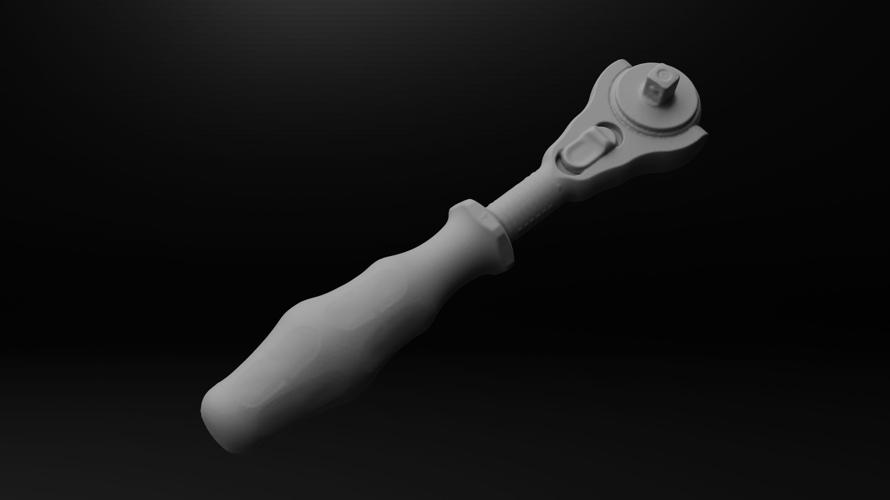 | <a href="Wera/Wera_8000_A_v1.stl" title="Wera/Wera_8000_A_v1.stl">Wera 8000 A</a> | v1 | 2025-01-11 | Creality Raptor |

